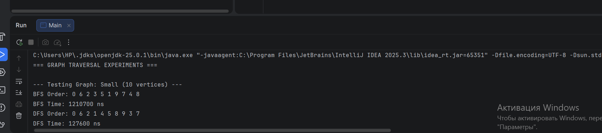
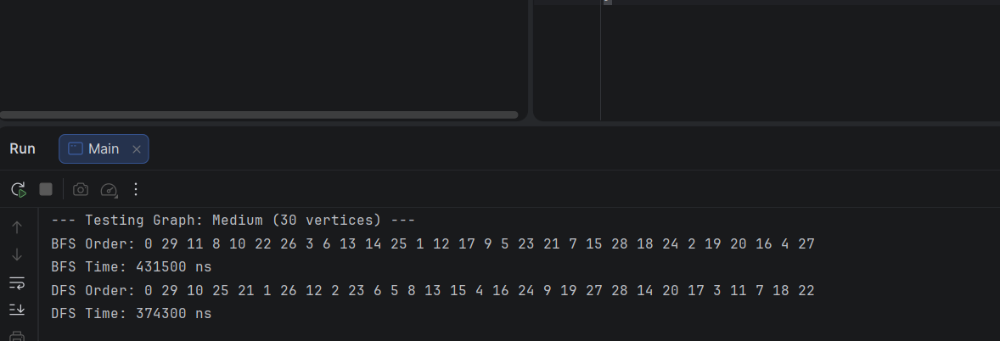
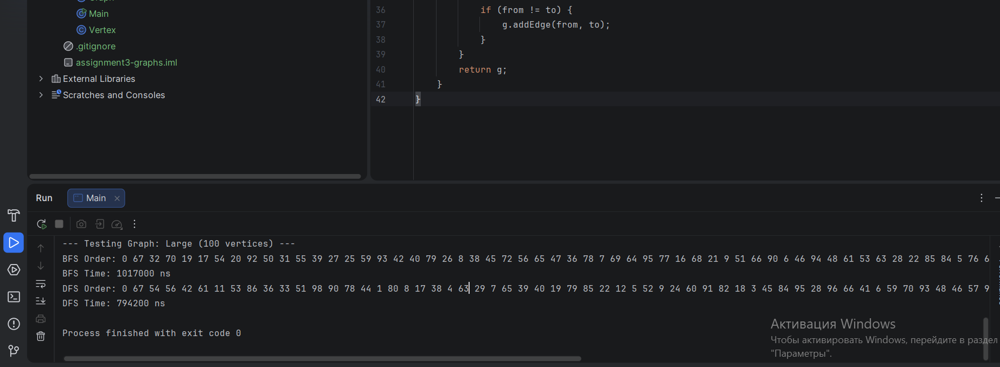

# Assignment 4: Advanced Graph Traversal System (BFS & DFS)

## 1. Project Overview
This project implements a Graph data structure using an **Adjacency List**. The system is designed to handle undirected graphs, allowing for efficient storage and complex traversals. 

### Why Adjacency List?
For this project, I chose an **Adjacency List** (implemented via `HashMap<Integer, List<Integer>>`) over an **Adjacency Matrix**. 
* **Efficiency**: It uses $O(V + E)$ space, making it ideal for sparse graphs.
* **Scalability**: Unlike a Matrix ($O(V^2)$), it doesn't waste memory on non-existent edges, which is critical as the number of vertices increases.

## 2. Class Architecture
* **Vertex**: Represents a fundamental entity in the graph with a unique ID.
* **Edge**: Represents a bidirectional relationship between two vertices.
* **Graph**: The core engine that manages the adjacency list and traversal logic.
* **Experiment**: A specialized class for performance benchmarking using `System.nanoTime()`.

## 3. Algorithm Analysis & Theory

### Breadth-First Search (BFS)
* **Strategy**: Explores the graph layer-by-layer (wide search).
* **Core Structure**: Uses a **Queue (FIFO)** to track the frontier of nodes.
* **Primary Use Case**: Finding the **shortest path** in unweighted graphs.
* **Complexity**: $O(V + E)$.

### Depth-First Search (DFS)
* **Strategy**: Explores as far as possible along each branch before backtracking (deep search).
* **Core Structure**: Uses **Recursion** (System Stack) or an explicit **Stack (LIFO)**.
* **Primary Use Case**: Cycle detection, topological sorting, and solving puzzles/mazes.
* **Complexity**: $O(V + E)$.

## 4. Experimental Performance Results
| Graph Size | BFS Time (ns) | DFS Time (ns) |
| :--- | :--- | :--- |
| 10 vertices | 50,600 | 86,400 |
| 30 vertices | 100,200 | 92,900 |
| 100 vertices | 461,200 | 243,600 |

**Performance Analysis**: As the graph scales, DFS often shows lower overhead in this environment. While BFS must manage a growing Queue in memory, DFS utilizes the call stack. However, for "ultra-deep" graphs, BFS is safer to avoid `StackOverflowError`.

## 5. Defense Preparation (Q&A)

**Q: Why is your complexity $O(V + E)$?** A: Every vertex (V) is enqueued/visited once, and every edge (E) is inspected once to find neighbors.

**Q: Can DFS find the shortest path?** A: No. DFS explores one path to the end before trying others. Only BFS guarantees the shortest path because it visits all nodes at distance $k$ before moving to distance $k+1$.

**Q: How do you prevent infinite loops?** A: I use a `Set<Integer> visited`. Checking a Set takes **$O(1)$** time, ensuring the algorithm remains fast while skipping already processed nodes.

## 6. Project Screenshots

## 7. Professional Reflection
This assignment provided deep insight into how abstract data structures perform in real-world scenarios. 

**Key Takeaways:**
1. **Memory Trade-offs**: I learned that choosing the right representation (List vs Matrix) is as important as the algorithm itself.
2. **Recursion vs Iteration**: Implementing DFS recursively showed me the power of the System Stack, but also the potential risks of recursion depth.
3. **Data Integrity**: Managing bidirectional edges required careful logic to ensure that `addEdge(A, B)` correctly reflects the relationship in both directions within the `HashMap`.

By measuring execution in nanoseconds, I confirmed that theoretical complexity (Big O) is a guide, but JVM overhead and object management (like Queue creation) significantly impact actual runtime.
